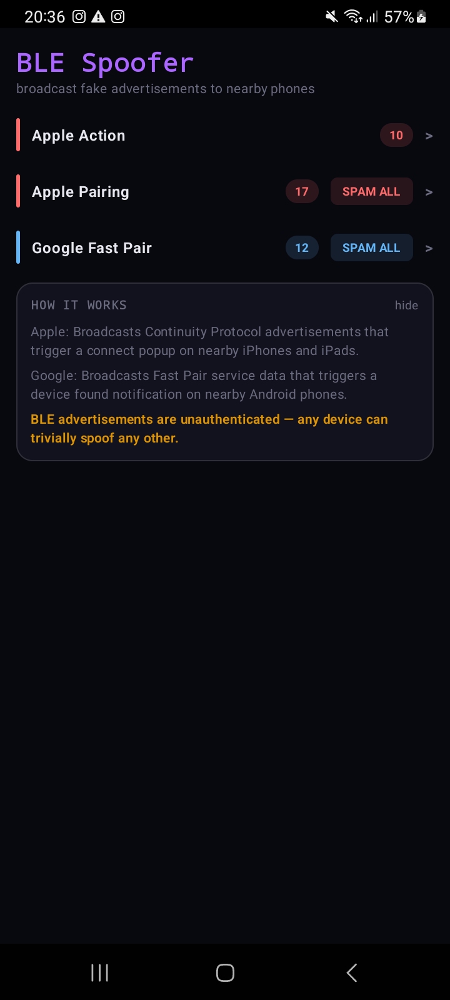
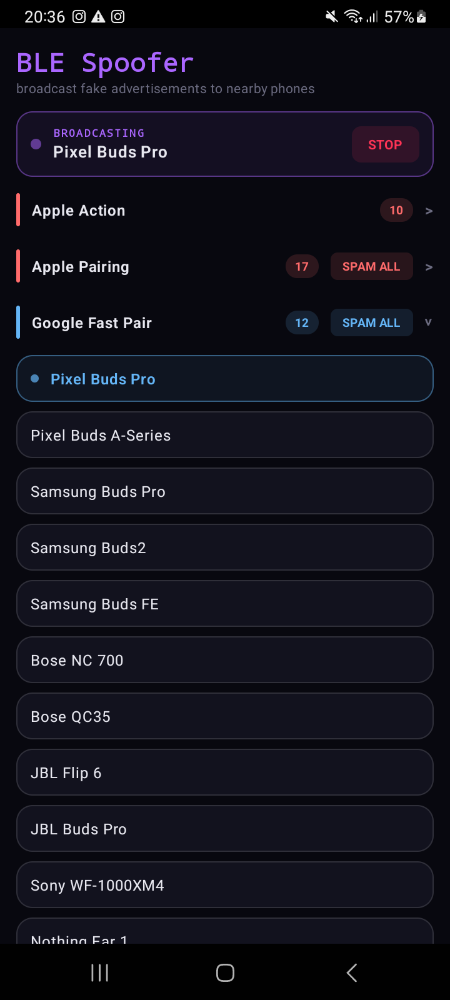
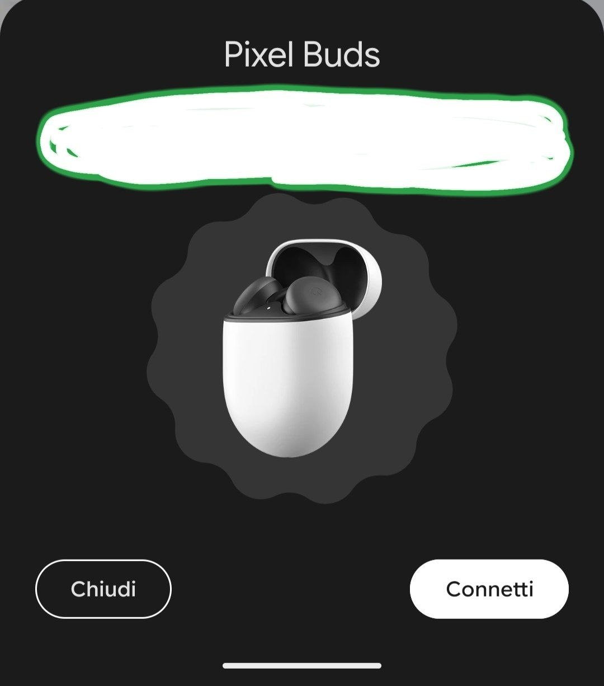

If you wanna help me

# BLE Spoofer

Android app that broadcasts fake Apple Continuity and Google Fast Pair BLE advertisements from your phone.
Triggers AirPods/AirTag pairing popups on nearby iPhones and Fast Pair notifications on nearby Androids.
Includes a SPAM mode that rotates through every model on a 3–4s loop to flood targets with notifications.
For authorized testing and research only — do not point it at devices you do not own.

# Screenshots

  
  
  

